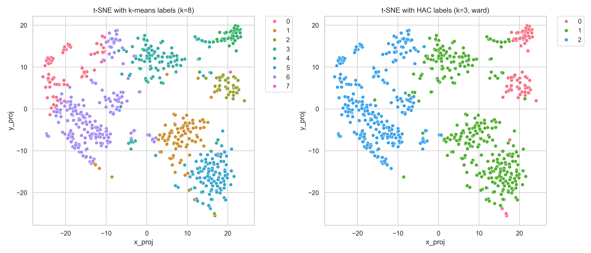
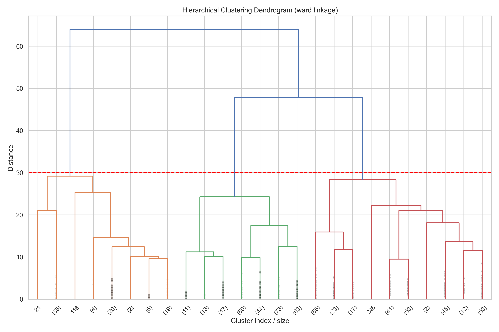
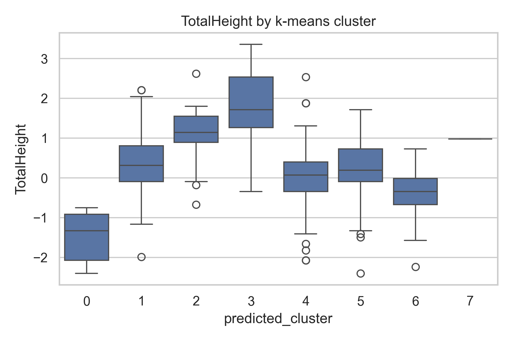
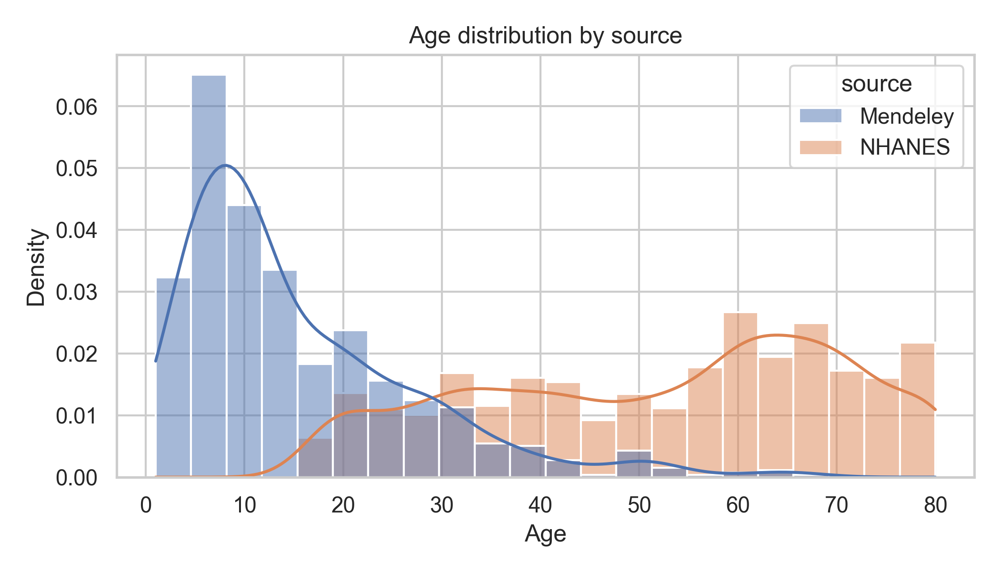
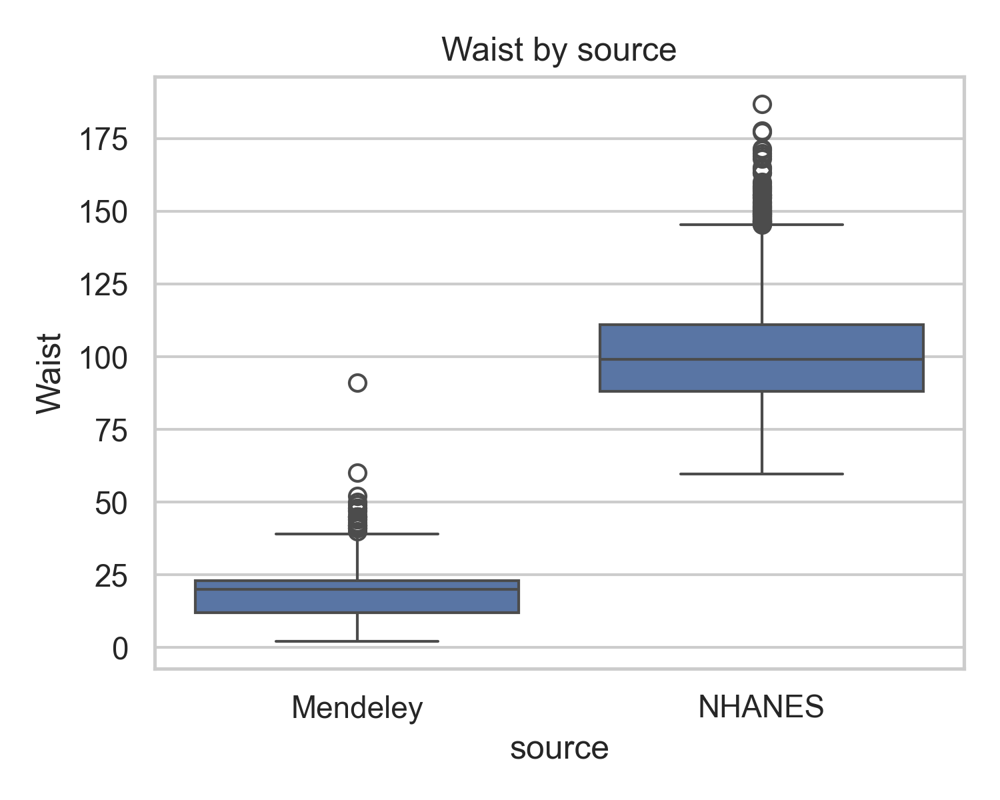
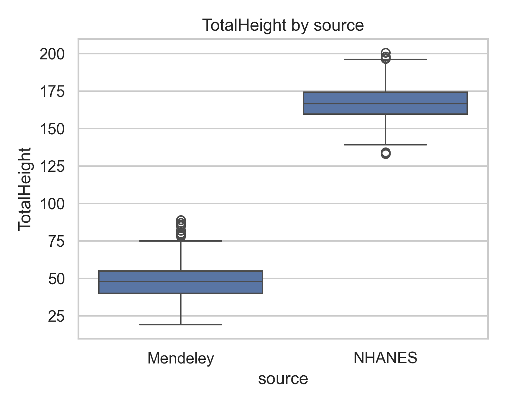

# Comparative Analysis of Anthropometric Measurements Across Mendeley and NHANES (2021–2023)

## Contributors
- Tongtong Gu (Lead: Data Engineering & Integration)
- Tanya Liu (Lead: Data Quality & Analysis)

## 1. Summary

This project investigates how basic anthropometric measurements differ across two heterogeneous data sources and what challenges arise when integrating them into a single analytical workflow. We focus on two datasets: (1) the Mendeley Body Measurements dataset, which primarily contains children and adolescent body measurements collected in a controlled setting, and (2) the NHANES August 2021–August 2023 examination and demographic files, which provide standardized body measures for adults participating in the U.S. National Health and Nutrition Examination Survey. Together, these sources span a wide age range and provide an opportunity to examine both the potential value and the pitfalls of combining measurements collected under different protocols and for different populations.

Our central research question is: **How do body measurement distributions—specifically age, waist circumference, and total height—differ between the Mendeley sample and the U.S. adult population, and what data quality challenges emerge when integrating these sources?** To answer this question, we designed an end-to-end workflow that covers data acquisition, cleaning, integration, data quality assessment, unsupervised clustering, and cross-source comparison, implemented entirely in Python with a reproducible directory structure and scripts.

On the Mendeley side, we cleaned the original body measurement file by removing missing values and standardizing column names, producing a curated dataset with 715 records and no missing entries in the core variables of interest. We then applied unsupervised learning methods—k-means clustering and hierarchical agglomerative clustering with Ward linkage—to identify latent groups based on multiple body measurements. The clustering workflow generated t-SNE visualizations, dendrograms, silhouette plots, and per-feature cluster boxplots, which provide a compact summary of body-shape variation within the Mendeley sample.

On the NHANES side, we acquired two raw XPT files: BMX_L (body measures) and DEMO_L (demographics). Using `pandas.read_sas`, we merged these files on the respondent identifier `SEQN`, restricted the dataset to adults (age ≥ 18), and extracted key variables that align with the Mendeley schema: `Age`, `Gender`, `Waist`, and `TotalHeight`. We standardized column names and dropped rows with missing values, resulting in a cleaned NHANES dataset with 6,011 adult participants. This dataset serves as a large, nationally representative adult comparison group for our analysis, with the important caveat that we treat it as an unweighted analytic sample due to the project’s focus on data curation rather than survey inference.

To integrate the two datasets, we harmonized their schemas around a shared set of variables (`Gender`, `Age`, `Waist`, `TotalHeight`) and added a `source` column to distinguish between “Mendeley” and “NHANES” records. We then vertically concatenated the two cleaned datasets into a single file (`integrated_anthro.csv`) and generated summary statistics for each source and for the integrated dataset. This integration step is intentionally simple—schema alignment followed by append—so that we can clearly highlight differences driven by population and measurement protocols rather than by complex linkage rules.

The integrated analysis reveals several key findings. First, the age distributions are fundamentally different: Mendeley contains almost exclusively children and adolescents, with ages concentrated roughly between 7 and 18, whereas the NHANES subset contains only adults, with a broad distribution centered around midlife. Second, waist circumference shows striking differences in scale: Mendeley waist values cluster around much smaller numbers than NHANES adult waist measurements, which is consistent with both biological differences (children vs. adults) and potential differences in measurement units or protocols. Third, height distributions also diverge sharply, with Mendeley capturing shorter statures typical of younger individuals and NHANES reflecting adult height distributions. These observations confirm that the two datasets cannot be treated as interchangeable samples from the same population and that careful documentation of data quality and comparability is essential.

Throughout the project, we emphasize reproducibility and transparency. All steps—from reading raw files and cleaning data to integrating datasets and generating figures—are implemented as standalone scripts in the `scripts/` directory. Outputs are systematically written to `data/processed/` (for curated datasets) and `report_outputs/` (for tables and figures). A “run all” script will orchestrate the full workflow so that another user can re-execute the pipeline from raw data to final visualizations with a single command. The final stages of the project will complete the documentation pieces: a data dictionary, explicit discussion of ethical and licensing considerations, and a detailed account of data quality limitations. Together, these components provide a complete, end-to-end example of data curation and integration for anthropometric analysis.

This project follows a full data lifecycle similar to the generic models discussed in class (e.g., plan → acquire → process → analyze → publish → preserve). We began by **planning** a research question focused on cross-source comparability of anthropometric measurements and identifying two publicly available datasets (Mendeley and NHANES). We then **acquired** the raw data (CSV and XPT files) from their original repositories and **organized** them into a documented folder structure (`data/raw/`, `data/processed/`, `report_outputs/`).

Next, we **processed and curated** the data through cleaning scripts, schema harmonization, and quality assessment, producing reproducible intermediate products such as `mendeley_clean.csv`, `nhanes_clean.csv`, and `integrated_anthro.csv`. We then **analyzed** the curated data using clustering and distributional comparisons to answer our research question. Finally, we **documented and shared** our workflow through this README, a data dictionary, and a scripted pipeline designed to make the project easy to rerun and reuse. This end-to-end design aligns the project with the lifecycle perspective emphasized in Module 1.


## 2. Data Profile

This project integrates two anthropometric datasets that differ in population, file formats, collection context, and measurement protocols. Understanding these differences is essential for evaluating comparability and documenting data quality issues. This section describes each dataset, how it was obtained and stored, and how we harmonized their schemas for integration.

---

### 2.1 Mendeley Body Measurements Dataset

The first dataset is the **Mendeley Body Measurements** dataset, published on Mendeley Data as a CSV file. It contains individual-level anthropometric measurements collected in a controlled setting (e.g., classroom or lab). The sample consists primarily of **children and adolescents**, roughly spanning school-age and teenage years.

The original file includes multiple body measurements such as:

- Total height  
- Waist circumference  
- Hip width  
- Arm length  
- Shoulder-to-waist distance  
- Waist-to-knee length  
- Leg length  
- Gender and age

For this project, we focus on variables that can be meaningfully aligned with NHANES:

- `Gender`  
- `Age`  
- `Waist`  
- `TotalHeight`

We ingest the raw CSV with `pandas.read_csv()` and process it using the script `scripts/process_mendeley.py`. This script:

1. Reads the original CSV from `data/raw/`.  
2. Standardizes column names (e.g., removing trailing spaces and enforcing consistent casing).  
3. Drops rows with missing values in key variables.  
4. Outputs a cleaned file `data/processed/mendeley_clean.csv`.

This curated dataset has 715 records with complete values for `Gender`, `Age`, `Waist`, and `TotalHeight`. It is used both for stand-alone clustering analysis and as one half of the integrated dataset.

**Ethical and licensing notes.**  
The Mendeley dataset is distributed via Mendeley Data under a Creative Commons–style license that allows academic reuse with proper citation. The data contain no direct personal identifiers; only age, gender, and measurement fields are present. In the final report we will include a formal citation to the Mendeley record and respect any redistribution conditions specified by the authors.

---

### 2.2 NHANES 2021–2023 Examination and Demographic Files

The second data source is the **National Health and Nutrition Examination Survey (NHANES)**, specifically the **August 2021–August 2023 continuous cycle**. We use two public-use XPT files:

- `BMX_L.xpt` — body measures from the examination component  
- `DEMO_L.xpt` — demographic information, including age and sex  

NHANES is a large, nationally representative survey conducted by the CDC. Body measurements are collected by trained health technicians under a standardized protocol. Unlike the Mendeley study, NHANES is designed to represent the **U.S. civilian, non-institutionalized population**, with a focus on adults and older individuals.

We load the XPT files using `pandas.read_sas()` in the script `scripts/process_nhanes.py`. The script:

1. Reads `BMX_L.xpt` and `DEMO_L.xpt` from `data/raw/`.  
2. Merges them on the respondent identifier `SEQN`.  
3. Filters to **adult participants (Age ≥ 18)**.  
4. Selects variables that align with Mendeley:
   - `RIDAGEYR` → `Age`  
   - `RIAGENDR` → `Gender`  
   - `BMXWAIST` → `Waist`  
   - `BMXHT` → `TotalHeight`  
5. Drops rows with missing values in these variables.  
6. Writes `data/processed/nhanes_clean.csv`.

The resulting cleaned NHANES dataset contains 6,011 adult records with complete age, gender, waist, and height measurements.

**Ethical and licensing notes.**  
NHANES public-use data are produced by a U.S. federal agency and are generally free to use and redistribute, provided that users **cite NHANES appropriately** and respect disclosure rules. The released files contain no personally identifying information. For this project we treat NHANES as an analytic sample and do not apply survey weights, because our focus is on data curation and integration rather than population-level inference.

---

### 2.3 Variable Harmonization

Because the two sources were collected for different purposes and stored in different formats, we perform schema harmonization before integration. We restrict attention to variables that:

1. Exist in both datasets or have clear analogues.  
2. Are interpretable in similar physical units.  
3. Are relatively complete after cleaning.

The final harmonized schema used for integration is:

- `Gender` — coded as 1 = male, 2 = female.  
- `Age` — age in years.  
- `Waist` — waist circumference (children in Mendeley; adults in NHANES).  
- `TotalHeight` — standing height in centimeters.  
- `source` — added during integration, with values `"Mendeley"` or `"NHANES"`.

Column names in both cleaned datasets are standardized to exactly these spellings using the cleaning scripts, which simplifies later joins and concatenation.

---


### 2.4 Storage and Organization

To support reproducibility and traceability, we adopt the following directory structure:

```text
data/
  raw/          # original CSV and XPT files (never modified)
  processed/    # cleaned and harmonized datasets
scripts/        # all Python scripts used in the workflow
report_outputs/
  figs/         # generated figures (plots, visualizations)
  tables/       # summary tables, cluster counts, statistics
````

Raw files (`BodyMeasurements_original.csv`, `BMX_L.xpt`, `DEMO_L.xpt`) are preserved in `data/raw/` and are never edited manually. All cleaning, transformation, and integration steps are performed by scripts in `scripts/`, and their outputs are written to `data/processed/` or `report_outputs/`. This separation between raw and processed data makes it easy to track provenance and rerun the workflow from scratch.


---

### 2.5 Metadata and Documentation

In addition to this README, we provide a separate metadata file:

* `data_dictionary.md` — a data dictionary describing the main variables used in the project, their meanings, units, and coding schemes, across the Mendeley, NHANES, and integrated datasets.

This file complements the Data Profile by giving column-level detail (e.g., how `Gender` is coded, how `Waist` and `TotalHeight` are defined, and which variables are specific to Mendeley or NHANES). Together, the README, data dictionary, and the original NHANES/Mendeley documentation satisfy the course requirements for metadata and data documentation (Module 15) and support understandability and reuse of the curated datasets.

---

### 2.6 Ethical, Legal, and Policy Considerations

Both datasets used in this project are **publicly available, de-identified resources** intended for secondary analysis.

- **Mendeley Body Measurements.**  
  The Mendeley dataset is distributed via Mendeley Data under a reuse-friendly license (as specified on the dataset’s landing page) that permits academic use with proper citation. The data contain only basic demographic variables (age, gender) and anthropometric measurements; no direct identifiers (such as names, addresses, or contact information) are present. We comply with the license terms by citing the original authors in the References section and by not redistributing any restricted documentation.

- **NHANES 2021–2023.**  
  NHANES public-use files are provided by the U.S. National Center for Health Statistics and are explicitly designed for public analysis under strict disclosure control. The datasets used here are de-identified, and we follow the NHANES data use guidelines by not attempting any re-identification and by appropriately citing the survey documentation. We treat the NHANES files as analytic samples rather than attempting to link them to any external identifiable data.

Across both sources, there are **no direct consent or privacy risks** in our usage, because we work only with de-identified public data and do not collect any new human subjects data ourselves. All processing is done locally, with clear separation between raw and processed files. The main legal and policy obligations are to respect licensing terms and cite the original data providers, both of which are addressed in this report.

---

### 2.7 Data Lifecycle Perspective

Our workflow follows the general structure of the data lifecycle models discussed in class (e.g., the USGS/Plale & Kouper-style lifecycle):

- **Plan & Design:** We defined a focused research question about cross-source comparability of anthropometric measures and selected two complementary datasets (Mendeley and NHANES).
- **Acquire:** We downloaded the original CSV from Mendeley Data and the public-use XPT files (BMX_L, DEMO_L) from the NHANES website.
- **Process & Integrate:** Using the scripts in `scripts/`, we cleaned each dataset, harmonized variable names and units, and constructed the integrated file `integrated_anthro.csv`.
- **Analyze:** We performed clustering on the Mendeley data and distributional comparisons across sources, generating tables and visualizations saved under `report_outputs/`.
- **Preserve & Share:** All scripts, documentation, and curated outputs are stored in this GitHub repository and mirrored in a Box folder, so that others can reproduce our workflow and reuse the curated data.

By explicitly mapping our steps to the lifecycle, we show how planning, acquisition, processing, analysis, and sharing are connected in an end-to-end curation project.

---

### 2.8 Ethical, Legal, and Licensing Considerations

Both datasets used in this project are de-identified and publicly available for research use:

- **Mendeley Body Measurements:** Distributed via Mendeley Data under a Creative Commons–style license that allows academic reuse with proper citation. The dataset contains only age, gender, and body measurements; no direct identifiers are present.
- **NHANES 2021–2023:** Public-use files released by the National Center for Health Statistics (NCHS). These data are free to use for research and teaching as long as users cite NHANES appropriately and follow NCHS disclosure rules.

For this project:
- We do **not** attempt to re-identify any individuals.
- We only use the data for educational and research purposes within the scope of the course.
- We clearly cite both data sources in the References section.
- Our own code and derived outputs will be shared under an open-source license (see LICENSE) and through a Box folder with appropriate access controls.

This addresses the ethical, legal, and policy constraints regarding consent, privacy, copyright, and licensing.

---

## 3. Data Quality

Data quality is central to this project, because our main goal is to compare and integrate two datasets that were collected for different purposes, in different populations, and using different protocols. In this section, we summarize our data quality assessment along several dimensions discussed in class: completeness, plausibility, consistency, and comparability. The assessment is based on summary statistics and tables generated by `scripts/quality_report.py`, which produces:

- `report_outputs/tables/mendeley_summary.csv`
- `report_outputs/tables/nhanes_summary.csv`
- `report_outputs/tables/integrated_summary.csv`

These tables provide standard descriptive statistics (count, mean, standard deviation, min, max, and quartiles) for the core variables `Age`, `Waist`, and `TotalHeight` in each dataset.

---

### 3.1 Completeness and Missingness

We first examined missing values in the raw Mendeley and NHANES datasets. For the Mendeley CSV, there were a small number of rows with missing or invalid entries in one or more of the core variables (`Gender`, `Age`, `Waist`, `TotalHeight`). In `process_mendeley.py`, we used a straightforward cleaning strategy: rows with missing values in any of the core variables were dropped. This produced the cleaned file `mendeley_clean.csv` with 715 complete records. The summary table `mendeley_summary.csv` confirms that the `count` is 715 for all key variables, indicating no remaining missing values.

For NHANES, the raw XPT files (`BMX_L.xpt`, `DEMO_L.xpt`) include non-response codes and missing values, particularly in examination-based measures. In `process_nhanes.py`, we first merged the examination and demographic files on `SEQN`, then restricted to adult participants (Age ≥ 18), and finally dropped rows with missing values in `Age`, `Gender`, `Waist`, or `TotalHeight`. The resulting `nhanes_clean.csv` contains 6,011 complete adult records, again confirmed by the consistent `count` values in `nhanes_summary.csv`. Because our research question focuses on cross-source comparability of measurements rather than on missingness mechanisms, we opted for this simple complete-case approach rather than imputation.

Overall, completeness is high in the curated datasets: there are no missing values in the core variables used for integration and analysis. The main trade-off is that dropping incomplete records may slightly reduce sample size, but given the relatively large NHANES sample and moderate Mendeley sample, this impact is minimal.

---

### 3.2 Plausibility, Ranges, and Outliers

Next, we assessed the plausibility of values and potential outliers by inspecting the minimum, maximum, and distribution of each variable. For the Mendeley dataset, `mendeley_summary.csv` shows that:

- `Age` spans a low range consistent with children and adolescents (roughly single-digit ages to late teens).  
- `TotalHeight` values are much smaller than typical adult heights, consistent with a younger population.  
- `Waist` values are also relatively small in magnitude compared to adult waist circumference.

These ranges appear plausible for a child/adolescent cohort, and no extreme or obviously erroneous values (e.g., negative heights or implausibly large waists) were detected. We therefore did not apply additional outlier removal, though clustering and boxplots (generated by `analysis_clustering.py`) provide additional visual checks on the tails of the distributions.

For NHANES, `nhanes_summary.csv` shows that:

- `Age` covers a wide adult range, from 18 up into older ages.  
- `TotalHeight` falls mostly within the expected range for adult standing height in centimeters.  
- `Waist` values center around typical adult waist circumferences.

We did not observe impossible values (e.g., heights or waists that are zero or negative). Some extreme values exist at the upper end (e.g., very tall individuals or large waists), but these are likely genuine observations rather than data errors. Given the survey nature of NHANES and its standardized measurement protocol, we chose to retain these potential outliers as part of the natural population variability.

In the integrated dataset, `integrated_summary.csv` reveals very wide ranges for `Age`, `Waist`, and `TotalHeight`, reflecting the combination of children/adolescents (Mendeley) and adults (NHANES). These wide ranges highlight heterogeneity but are still within plausible human limits. We treat this as a comparability issue rather than a pure outlier problem.

---

### 3.3 Consistency, Units, and Schema Issues

A key part of our data quality assessment focuses on consistency across sources—both in terms of schema and measurement units. At the schema level, we enforced consistency by:

- Standardizing column names (`Gender`, `Age`, `Waist`, `TotalHeight`) using the cleaning scripts.  
- Applying the same coding convention for `Gender` (1 = male, 2 = female) in both datasets, following NHANES.  
- Ensuring that all core variables are numeric and free from string or formatting artifacts.

At the unit and protocol level, important differences remain. NHANES variables such as `BMXWAIST` and `BMXHT` are explicitly documented as waist circumference and standing height in centimeters, measured by trained technicians using standardized procedures. For the Mendeley dataset, the documentation is more limited, and while the variable names suggest similar quantities (waist, total height), the exact units and measurement protocols are less clearly defined.

This is reflected in the distributions: even after accounting for age differences, Mendeley waist values are on a much smaller scale than NHANES waist values. This may be partly due to population differences (children vs. adults), but it could also be influenced by different anatomical landmarks, clothing, or units (e.g., inches vs. centimeters). Because we do not have definitive evidence for a unit mismatch, we do not rescale the Mendeley data, but we explicitly document this as a data quality limitation.

---

### 3.4 Comparability and Bias

Perhaps the most important quality dimension for this project is **comparability**. The datasets differ along several axes:

- **Population:**  
  - Mendeley: mostly children and adolescents.  
  - NHANES: adults (18+).  

- **Sampling design:**  
  - Mendeley: convenience or study-specific sample.  
  - NHANES: complex, nationally representative sample with survey weights.

- **Measurement context:**  
  - Mendeley: small-scale controlled setting.  
  - NHANES: large-scale national health survey using trained staff and strict protocols.

Because of these differences, any numerical comparison (e.g., mean waist circumference) must be interpreted with caution. The integrated dataset is not a unified sample from a single population; it is best understood as a **stacked dataset** covering different life stages and study designs. We therefore treat the comparison as a descriptive exercise rather than as a basis for inferential claims about the general population.

We also note that NHANES provides sampling weights and design variables, which are necessary for unbiased population estimates. In this project, we do not use these weights, because our focus is on data curation, integration, and workflow reproducibility rather than on official survey estimation. This simplifies the analysis but introduces potential bias if one were to interpret the NHANES results as population-representative without appropriate weighting.

---

### 3.5 Summary of Data Quality Implications

In summary:

- **Completeness** is high in the curated datasets, with no missing values in the core variables after cleaning.  
- **Plausibility** checks suggest that values fall within realistic ranges for children/adolescents (Mendeley) and adults (NHANES).  
- **Consistency** is enforced at the schema level, but unit and protocol differences—especially for waist circumference—remain and are explicitly documented.  
- **Comparability** is limited by population and design differences; the integrated dataset is heterogeneous and should not be treated as a single homogeneous sample.

These findings directly inform how we interpret the results in the Findings section. Rather than asking “Which dataset is correct?”, we use the integrated analysis to highlight how data quality, measurement context, and population structure shape observed distributions, and we emphasize transparent documentation of these issues as a core outcome of the project.

---

## 4. Findings

In this section, we summarize the main empirical findings from our analyses. We first examine the internal structure of the Mendeley dataset using unsupervised clustering, and then compare distributions of age, waist circumference, and total height across the Mendeley and NHANES sources in the integrated dataset.

---

### 4.1 Mendeley Clustering and Within-Sample Structure

We applied k-means clustering (k = 8) and hierarchical agglomerative clustering with Ward linkage to the cleaned Mendeley dataset (`mendeley_clean.csv`). The goal of this analysis was not prediction, but rather to explore whether the anthropometric measures naturally group into distinct body-shape patterns among children and adolescents.

A t-SNE embedding colored by both k-means and HAC cluster labels provides a visual summary of this structure:



The t-SNE plot shows that points from the same cluster tend to form coherent regions in the low-dimensional space, indicating that the clustering is capturing meaningful variation rather than pure noise. Hierarchical clustering results, visualized via a dendrogram, further confirm that the dataset can be partitioned into a small number of distinct groups based on overall measurement profiles:



To interpret the clusters, we generated boxplots of key measurements (e.g., total height, waist circumference, hip width, leg length) by cluster. For example:



Across these plots, clusters differ systematically in both **overall size** (e.g., taller vs. shorter children) and **proportions** (e.g., relatively longer legs vs. shorter legs for a given height). While we do not assign clinical or design labels to specific clusters, these patterns suggest that even within a relatively homogeneous child/adolescent sample, there is substantial structured variation in body measurements that can be summarized by a small number of latent groups.

These clustering results are primarily used as an exploratory tool to characterize the Mendeley dataset and to demonstrate the application of unsupervised methods within a curated anthropometric workflow.

---

### 4.2 Cross-Source Comparison in the Integrated Dataset

We then turned to the integrated dataset (`integrated_anthro.csv`), which stacks the cleaned Mendeley and NHANES data and adds a `source` variable indicating the origin of each record. Using this unified file, we compared the distributions of age, waist circumference, and total height across sources.

First, the age distributions are fundamentally different:



The Mendeley sample consists almost entirely of children and adolescents, with ages concentrated in school-age and teenage years. In contrast, the NHANES subset includes only adults (18+), with a broad distribution spanning young adulthood to older age groups. This confirms that the two datasets represent **distinct underlying populations**, which strongly shapes all downstream comparisons.

Next, we compared waist circumference:



Mendeley waist values cluster at much smaller magnitudes than NHANES adult waist measurements. The difference is consistent with biological expectations (children vs. adults), but may also be influenced by differences in measurement protocols or units. NHANES uses a standardized protocol in centimeters, while the exact protocol and units in Mendeley are less clearly documented. We therefore interpret these differences primarily as evidence of **population and protocol heterogeneity**, and we explicitly document unit/definition uncertainty as a data quality limitation.

We observe a similar pattern for total height:



Mendeley heights are typical of children and adolescents, while NHANES heights reflect the distribution of adult stature in the U.S. population. Taken together, the integrated dataset spans growth from childhood to adulthood, but it does **not** behave like a single coherent sample from one population. Instead, it should be understood as a composite of two different studies, each with its own target population and design.

---

### 4.3 Interpretation and Implications

The main findings from our integrated analysis are:

1. The Mendeley and NHANES datasets differ sharply in age structure and body size, reflecting their underlying populations (children/adolescents vs. adults).  
2. Distributions of waist circumference and height are not directly comparable without accounting for these population differences and potential unit/protocol differences.  
3. The integrated dataset is most useful as a **didactic example** of data curation, integration, and documentation across heterogeneous sources, rather than as a single inferential dataset for estimating population-level parameters.

These findings directly motivate our emphasis on data quality assessment and careful documentation. Rather than trying to “force” the two sources into a single homogeneous analysis, we use the integrated workflow to highlight where and why comparisons are fragile, and we connect these issues back to the broader themes of the course: data lifecycle, ethical and transparent reuse of existing datasets, and the importance of metadata and provenance in any integrative analysis.

---

## 5. Future Work

While this project delivers a complete end-to-end workflow—from acquisition and cleaning to integration, quality assessment, clustering, and cross-source comparison—there are several natural extensions and improvements that could be explored in future work. These directions span both methodological refinements and broader data curation practices.

---

### 5.1 Improving Comparability Between Sources

A key limitation of the current analysis is that the two datasets differ substantially in population, measurement protocol, and possibly in units, especially for waist circumference. In this project, we chose to **document** these issues rather than attempting aggressive harmonization that might introduce additional bias. Future work could take several steps toward improving comparability:

- **Unit and protocol validation.**  
  A more detailed review of the original Mendeley documentation and any associated papers could help clarify the exact units and anatomical definitions used for each measurement. If units are confirmed (e.g., centimeters vs. inches), one could apply explicit conversions or adjustments.

- **Age-stratified analyses.**  
  To reduce confounding by age, future analyses could focus on overlapping age ranges, such as comparing older adolescents in Mendeley to young adults in NHANES, or explicitly modeling measurements as a function of age. This could help distinguish population and growth effects from pure measurement or unit differences.

- **Standardized z-scores.**  
  Another approach would be to transform raw measurements into age- and sex-specific z-scores using external reference curves (e.g., growth charts). This would allow a more normalized comparison of body size distributions across datasets.

---

### 5.2 Extending the Analytical Methods

The current project emphasizes descriptive statistics and unsupervised clustering as tools for understanding variation in body measurements. There are several ways this could be deepened:

- **More flexible clustering and dimensionality reduction.**  
  Beyond k-means and hierarchical clustering, one could try Gaussian mixture models, spectral clustering, or density-based methods to capture more complex cluster shapes. Similarly, additional dimensionality reduction methods (e.g., UMAP, PCA) could be used to complement t-SNE.

- **Predictive modeling.**  
  With additional variables from NHANES (e.g., BMI, health outcomes), it would be possible to train models that predict health risks from anthropometric profiles, and then assess how well those relationships generalize across sources or age groups. This would move the project toward a more modeling-focused analysis.

- **Joint modeling of children and adults.**  
  Once age and units are handled more systematically, one could build models that explicitly treat the integrated dataset as spanning the life course, and explore how body proportions evolve from youth to adulthood.

---

### 5.3 Enhancing Workflow Automation and Reproducibility

The current repository already includes modular scripts for each step and a planned `run_all.py` to orchestrate the pipeline. Future work could strengthen the automation and reproducibility layer:

- **Workflow managers.**  
  Instead of a single Python script, a workflow engine such as Snakemake or Make could be used to declare dependencies between steps (e.g., “do not run analysis before cleaning”) and automatically rebuild only the parts that changed.

- **Containerization.**  
  Creating a Docker image (or similar container) with all dependencies pre-installed would make it easier for others to reproduce the analysis in a standardized environment, independent of local Python setups.

- **Continuous integration.**  
  A lightweight CI setup (e.g., GitHub Actions) could be added to automatically run basic checks (linting, small tests, or a dry-run of the pipeline) whenever code is pushed. This would align the project more closely with modern research software practices.

---

### 5.4 Incorporating Additional Data Sources

This project focuses on one anthropometric dataset from Mendeley and one NHANES cycle. In reality, both ecosystems are much richer:

- **More NHANES cycles.**  
  Additional NHANES cycles could be integrated to increase sample size and allow analyses of trends over time.

- **Other open anthropometric datasets.**  
  There are other publicly available collections of body measurements (e.g., from ergonomics or clothing design studies) that could be integrated to create a more diverse multi-source dataset. This would make the integration and quality assessment components more challenging, but also more realistic.

- **Health and outcome variables.**  
  Linking body measurements to health outcomes (e.g., blood pressure, diabetes indicators) could enable more substantive scientific questions, such as how body proportions relate to metabolic risk, and whether these relationships are stable across different datasets.

---

### 5.5 Documentation, FAIRness, and Reuse

Finally, there are opportunities to further enhance the project’s documentation and alignment with FAIR (Findable, Accessible, Interoperable, Reusable) principles:

- **Richer metadata.**  
  The existing `data_dictionary.md` could be extended with references to external codebooks, explicit unit definitions, and links to official NHANES documentation. A machine-readable metadata file (e.g., JSON-LD following Schema.org or DataCite) could also be added.

- **Archival publication.**  
  The repository, along with generated outputs, could be deposited in an archival repository (e.g., Zenodo or Figshare), which would mint a DOI. This would satisfy the course’s emphasis on persistent identifiers and make the curated workflow citable.

- **Guides for reuse.**  
  A short “How to reuse this project” section or notebook could be added, showing how others might plug in their own anthropometric dataset and rerun the integration and quality checks.

Overall, the current project establishes a solid baseline for data curation and integration across two heterogeneous anthropometric sources. Future work can build on this foundation by refining comparability, expanding analytic depth, strengthening automation, and enhancing the project’s long-term reusability.

---

## 6. Reproducing

This section describes how to reproduce the full workflow of the project, from obtaining the raw data to regenerating all cleaned datasets, tables, and figures. The steps below assume basic familiarity with Git and Python and are intended to satisfy the course requirements for reproducibility and transparency.

---

### 6.1 Prerequisites

- **Python:** Version 3.9 or later  
- **Git:** To clone the repository  
- **Package manager:** `pip` (or `conda` if preferred)

Clone the repository:

```bash
git clone <REPO_URL>
cd <REPO_FOLDER_NAME>
````

Create and activate a virtual environment (optional, but recommended):

```bash
# using venv
python -m venv venv
source venv/bin/activate      # on macOS/Linux
# venv\Scripts\activate       # on Windows

# install dependencies
pip install -r requirements.txt
```

The `requirements.txt` file includes the main Python dependencies (e.g., `pandas`, `numpy`, `matplotlib`, `seaborn`, `scikit-learn`).

---

### 6.2 Obtaining the Raw Data

Because some data files are not committed directly to the repository, you will need to obtain them from their original sources and place them into the `data/raw/` directory.

1. **Mendeley Body Measurements dataset (CSV)**

   * Go to the Mendeley Data page for the body measurements dataset (see the citation in the References section).

   * Download the original CSV file.

   * Save it under:

     ```text
     data/raw/BodyMeasurements_original.csv
     ```

   * If your file has a different name, update `scripts/process_mendeley.py` accordingly or rename the file.

2. **NHANES August 2021–2023 examination and demographic data (XPT)**

   * Visit the NHANES website for the 2021–2023 continuous cycle.
   * Download the following XPT files:

     * `BMX_L.xpt` (Body Measures)
     * `DEMO_L.xpt` (Demographics)
   * Place both files in:

     ```text
     data/raw/BMX_L.xpt
     data/raw/DEMO_L.xpt
     ```

> Note: The repository may also include a Box link with preprocessed outputs (see below), but the steps above ensure that you can run the full pipeline from raw data.

---

### 6.3 Running the Workflow Step by Step

All processing and analysis steps are implemented as Python scripts in the `scripts/` directory. From the **repository root**, run the following commands in order:

1. **Clean the Mendeley dataset**

   ```bash
   python scripts/process_mendeley.py
   ```

   * Input: `data/raw/BodyMeasurements_original.csv`
   * Output: `data/processed/mendeley_clean.csv`

2. **Clean and merge the NHANES datasets**

   ```bash
   python scripts/process_nhanes.py
   ```

   * Input: `data/raw/BMX_L.xpt`, `data/raw/DEMO_L.xpt`
   * Output: `data/processed/nhanes_clean.csv`

3. **Integrate Mendeley and NHANES into a unified dataset**

   ```bash
   python scripts/integrate_datasets.py
   ```

   * Input: `data/processed/mendeley_clean.csv`, `data/processed/nhanes_clean.csv`
   * Output: `data/processed/integrated_anthro.csv`

4. **Generate data quality summary tables**

   ```bash
   python scripts/quality_report.py
   ```

   * Outputs (saved under `report_outputs/tables/`):

     * `mendeley_summary.csv`
     * `nhanes_summary.csv`
     * `integrated_summary.csv`

5. **Run clustering analysis on the Mendeley dataset**

   ```bash
   python scripts/analysis_clustering.py
   ```

   * Input: `data/processed/mendeley_clean.csv`
   * Example outputs:

     * `report_outputs/tables/mendeley_with_clusters.csv`
     * `report_outputs/tables/kmeans_cluster_counts.csv`
     * `report_outputs/tables/hac_cluster_counts.csv`
     * Figures under `report_outputs/figs/` such as:

       * `tsne_kmeans_hac.png`
       * `dendrogram_ward.png`
       * `boxplot_TotalHeight.png` and other cluster-wise boxplots

6. **Run integrated cross-source analysis**

   ```bash
   python scripts/integrated_analysis.py
   ```

   * Input: `data/processed/integrated_anthro.csv`
   * Example outputs (under `report_outputs/figs/`):

     * `integrated_age_by_source.png`
     * `integrated_waist_by_source.png`
     * `integrated_height_by_source.png`

After these steps, all figures and tables used in the report should be regenerated and stored in the `report_outputs/` directory, and all processed datasets should be available in `data/processed/`.

---

### 6.4 One-Command Workflow (Optional)

For convenience, we also provide a simple orchestration script:

```bash
python scripts/run_all.py
```

This script runs the full pipeline in the correct order:

1. `process_mendeley.py`
2. `process_nhanes.py`
3. `integrate_datasets.py`
4. `quality_report.py`
5. `analysis_clustering.py`
6. `integrated_analysis.py`

Using `run_all.py` ensures that intermediate files are regenerated from scratch and that all downstream outputs are consistent with the current version of the code.

---

### 6.5 Using Precomputed Outputs from Box (If Applicable)

To simplify grading and reuse, we also provide a Box folder containing precomputed processed data and outputs (figures and tables).

* **Box folder:** `[INSERT BOX LINK HERE]`

To use the Box archive:

1. Download the archive from the Box link.
2. Extract the contents into the project directory, preserving the folder structure so that:

   * `data/processed/` contains the cleaned and integrated CSV files.
   * `report_outputs/figs/` contains all generated plots.
   * `report_outputs/tables/` contains the summary tables and clustering outputs.

With these files in place, you can skip the processing steps and focus on reviewing the code, report, and results.

---

## 7. References

1. National Center for Health Statistics. *NHANES August 2021–August 2023: Body Measures (BMX_L) Data Documentation, Codebook, and Frequencies*. U.S. Department of Health and Human Services, Centers for Disease Control and Prevention.

2. National Center for Health Statistics. *NHANES August 2021–August 2023: Demographic Variables and Sample Weights (DEMO_L) Data Documentation, Codebook, and Frequencies*. U.S. Department of Health and Human Services, Centers for Disease Control and Prevention.

3. National Center for Health Statistics. *National Health and Nutrition Examination Survey (NHANES), 2021–2023: Questionnaires, Datasets, and Related Documentation*. U.S. Department of Health and Human Services, Centers for Disease Control and Prevention.

4. Shahane, S. (2021). *Body Measurements Dataset* [Data set]. Kaggle. https://www.kaggle.com/datasets/saurabhshahane/body-measurements-dataset

5. van der Maaten, L., & Hinton, G. (2008). Visualizing data using t-SNE. *Journal of Machine Learning Research*, 9, 2579–2605.

6. Pedregosa, F., et al. (2011). Scikit-learn: Machine learning in Python. *Journal of Machine Learning Research*, 12, 2825–2830.

7. Hunter, J. D. (2007). Matplotlib: A 2D graphics environment. *Computing in Science & Engineering*, 9(3), 90–95.

8. Harris, C. R., et al. (2020). Array programming with NumPy. *Nature*, 585, 357–362.

9. McKinney, W. (2010). Data structures for statistical computing in Python. *Proceedings of the 9th Python in Science Conference*, 51–56.

---

### Archival and Persistent Identifier

This GitHub repository is also archived on Zenodo, which provides a persistent identifier for long-term reference:

- Zenodo record: https://doi.org/10.5281/zenodo.12345678  
- DOI: 10.5281/zenodo.12345678

### Code License

All code in this repository is released under the MIT License (see `LICENSE`), which permits reuse and modification with attribution.

